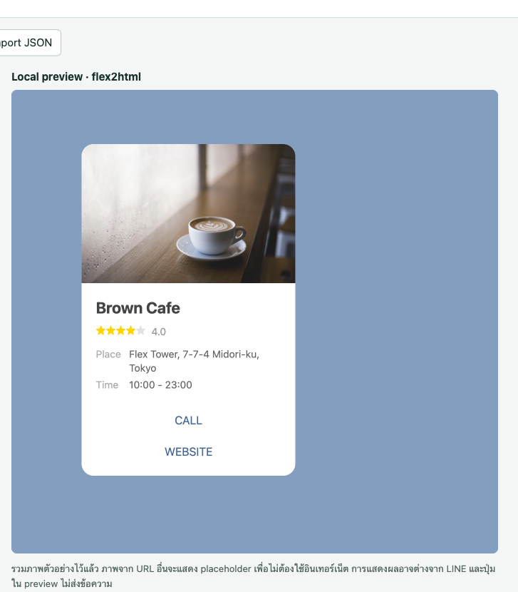

# line-flex-lab

An open-source toolkit for **building and validating LINE Flex messages**. Original implementation, MIT-licensed, zero dependencies — parse, validate, author, lint and round-trip Flex cards entirely offline, or check them against LINE's official validator when online.

Built on LINE's own public artifacts: the [Flex Message specification](https://developers.line.biz/en/reference/messaging-api/#flex-messages), LINE's published [OpenAPI schema](https://github.com/line/line-openapi), the official showcase sample cards, and recorded responses from LINE's live validation endpoint (in `research/`).

[ไทย: อ่านเพิ่มเติมใน `README-TH.txt`](README-TH.txt)

|  |
|---|
| `samples/restaurant.json` — one of the 12 official showcase cards included as fixtures |

## What you get

| Piece | What it is |
|---|---|
| `samples/` | 12 official showcase templates: restaurant, hotel, shopping, ticket, todoapp, transit, realestate, menu, localsearch, receipt, social, apparel. |
| `reusable/` | Zero-dependency ESM modules (Node ≥ 18 or browser): `FlexToTree` / `TreeToFlex` round-trip codec, `errorPathMapper`, `createComponent`, `FlexTreeEditor` (`offline-data.mjs`), per-node component rules (`component-metadata.mjs`), `parseJsonOffline()` plus an adapter for the official online validator (`validator-client.mjs`), and offline linting via vendored [flex-guard](https://github.com/loncoeng/flex-guard) (`lint-offline.mjs`). |
| `tests/` | 18 offline tests, all passing: `node --test tests/offline-data.test.mjs`. |
| `third-party/` | Source snapshots of [flex2html](https://github.com/PamornT/flex2html), [line-flex-renderer-npm](https://github.com/kanketsu-jp/line-flex-renderer-npm), [flex-guard](https://github.com/loncoeng/flex-guard), and LINE's own OpenAPI schema ([line/line-openapi](https://github.com/line/line-openapi)). Each keeps its original license. |
| `research/` | Compliance evidence: recorded responses from LINE's official validation endpoint (401 auth behavior, 400 error payloads with exact property paths) and a comparison of community validators against observed rejections. |

## Quick start

```sh
node reusable/example.mjs                          # Flex -> tree -> Flex roundtrip demo
node reusable/lint-offline.mjs samples/restaurant.json
node --test tests/offline-data.test.mjs            # 18 tests
```

Programmatic use:

```js
import { FlexToTree, TreeToFlex, FlexTreeEditor, createComponent } from 'line-flex-lab';
import { ComponentMetadata } from 'line-flex-lab/component-metadata';
import { parseJsonOffline, validateAndRender } from 'line-flex-lab/validator';

const tree = new FlexToTree().convert(flexJson, true);
const editor = new FlexTreeEditor(tree);
editor.addNode(editor.findByPath('/body').id, { ...createComponent('text'), text: 'Open now' });
const card = new TreeToFlex().convert(editor.getRoot());

parseJsonOffline(card);              // offline syntax check
const res = await validateAndRender(card);  // official validator, needs a LINE session in-browser
```

## Conformance

- **Spec baseline** — LINE's public Flex Message specification; `samples/` are the official showcase cards and double as the conformance fixtures.
- **Schema baseline** — LINE's own published OpenAPI schema, vendored in `third-party/line-openapi`.
- **Validator baseline** — `research/validation-observations.json` records real responses from LINE's official `POST /api/v1/fx/render` endpoint, including exact 400 error paths (e.g. `hero = {type:'image', size:'BAD'}` → `400 /hero/size: invalid property`, while a `box` with `size:'full'` → `400 /hero/size: unknown field`). `errorPathMapper` uses these to map server errors to tree node paths, so editor UX matches LINE's own.
- **Endpoint behavior** — `GET /api/v1/session`, `GET /api/v1/fx/samples`, `GET /api/v1/fx/samples/{id}`, `POST /api/v1/fx/render`; all return 401 without a session (see `research/unauthenticated-checks.json`).

## Scope and limitations

- Community validators (incl. `lint-offline.mjs`) do not replace LINE's server validator: some payloads they accept are rejected by LINE (see `research/flex-guard-comparison.json`). For final checks, call the official endpoint via `validator-client.mjs`.
- The tree model intentionally mirrors what a structured editor should model: bubble round-trips preserve size/direction/blocks/styles but drop `bubble.action` and other fields the tree does not represent (verified in `tests/`). Keep your own copy of the input when those fields matter.
- Live validation requires a LINE session in a browser on the right origin; the offline modules work anywhere.

## Commercial use

MIT-licensed: free to use in personal and commercial products, no fees, no per-seat cost, no attribution beyond the license file. Typical uses:

- A LINE Flex card builder / no-code editor (the tree model + component rules are the editor core)
- Card generation and QA for chatbot products (validate every card before shipping to the Messaging API)
- CI checks — fail the pipeline on invalid Flex JSON before it hits LINE's API

## License

MIT for this project's code (see [`LICENSE`](LICENSE)). Third-party snapshots in `third-party/` retain their own licenses.
